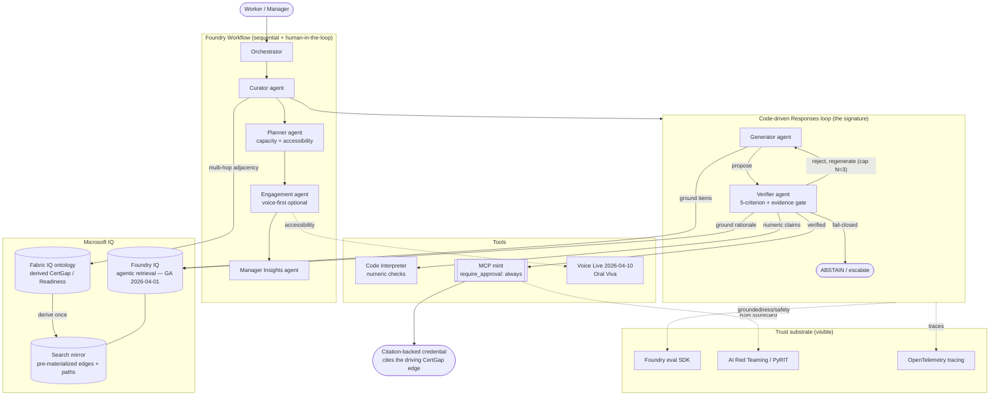

# PathForward — Architecture

> Foundry-centric. Every box maps to a Microsoft service or a module in this repo.
> This is the diagram for the submission (the rubric requires an architecture diagram
> showing the Microsoft tools).

## Agent topology + IQ wiring

## Key decisions (hardened by the red-team — see ../Microsoft-Agents-League/04-Plan-Redteam.md)

| Area | Decision |
|---|---|
| Loop | **Agentic tool-calling on the GA Responses API**: gpt‑5.5 is given the retrieval tool and *itself* decides when to call it (`tool_choice='auto'`, not `'required'`). Server-side prompt agents *with tools* DO exist on `azure-ai-projects 2.2.0` (`PromptAgentDefinition` / `create_version`); the classic thread/run surface is **deprecated (retiring 2027-03-31)**, not yet removed. The orchestrator still owns the payload → citations propagate deterministically, and the Verifier gates on `corpus ∩ retrieved`. |
| Grounding | The model's tool is the **GA agentic-retrieval knowledge base** (`KnowledgeBaseRetrievalClient`, `2026-04-01`, extractive `intents[]` + citations). **gpt‑5.5 plans/authors the searches; Search reranks + cites, it does not plan** (Search-side query planning is preview — kept off the critical path). |
| Fabric | Ontology authored as a **non-Power BI Fabric item** on a **paid F2+** (or Power BI Premium **P1+**) capacity (Trial can't run the data agent). The **Search mirror** is the runtime path. |
| Mirror | Pre-materializes base + **derived** edges (provenance + validity-time) + traversal paths as first-class docs; build-time non-empty guard. |
| Region | **East US 2** — our chosen co-location for Foundry + gpt-5.5 + Fabric. *Not the only viable region* (gpt-5.5 spans ~6 regions, Voice Live agent mode ~17; e.g. **Sweden Central** also satisfies all four). **Azure AI Search runs in East US** — note **both East US and East US 2 carry the Search capacity-constraint footnote**, so this is an operational placement, not a capacity workaround. Cross-region Search↔model is fine — only the Fabric data agent needs co-location. |
| Reliability | Loop hard-capped **N=3 → fail-closed abstain**; the credential mint refuses abstained results and asserts `cited_edge_id == driving CertGap edge`. |
| Observability | **OpenTelemetry tracing** (`pathforward/obs/tracing.py`) makes the propose→verify→(reject→regenerate)→mint flow a timed **span tree** — `verifier.struck` and `abstained.fail_closed` are real span events; grounding/retrieval/readiness are span attributes. An **optional layer, no-op by default** (offline core + 46 tests untouched), exporting to the **Console** (demo span tree, `scripts/trace_demo.py`) and **Azure Monitor / Foundry Tracing tab** when a connection string is set. Loop-spans-only (no raw-model-call capture); `opentelemetry-sdk` pinned to 1.37 for exporter compat. |
| Eval / Safety | A **deterministic eval + red-team pack** (`pathforward/eval/`, `scripts/eval_groundedness.py`, `scripts/redteam_live.py`) — pass/fail decided in code, never an LLM judge. A 22-family adversarial taxonomy hardened the trust boundary (cross-worker mint contamination, derived-not-supplied readiness, homoglyph leakage, numeric tie-back, uncorpused-skill refusal); 12 offline gate proofs + a **live ASR scorecard (0% — 9/9 held)** under defense-in-depth (RAI content filter blocks jailbreaks; the `corpus ∩ retrieved` gate blocks forgery; phantom entities abstain). Microsoft Foundry's GroundednessEvaluator is a corroborating second opinion. Known LLM-judgment limitations are documented, not hidden. |
| Governance | A **Foundry Toolbox** (`pathforward-toolbox`) + named **Skill** (`pathforward`) register the search capability as a **versioned, RAI-policy-bearing catalog** (`scripts/build_toolbox.py`). RAI (`pathforward-rai`, Blocking) is **enforced at the model deployment** and **declared on the toolbox**; agent-definition `rai_config` is a 2.2.0 preview gap (rejects even system policies) so it is not used — _(updated 2026-06-07: **per-agent guardrail assignment is now a documented Foundry feature (Preview)** via the Guardrails portal/REST; roadmap for us, not yet wired)_. For **prompt agents** the registered toolbox is a **governance/registry artifact, not a demonstrated inference consume-seam** (`PromptAgentDefinition` carries no toolbox ref) — inference stays on the proven GA direct-attach. _(updated 2026-06-07: a toolbox **MCP endpoint** `{project_endpoint}/toolboxes/{name}/mcp` does exist — superseding an earlier "no `/mcp`" note — but its documented consumers are agent-framework / hosted-agent / MCP-client runtimes; prompt-agent consumption is prose-mentioned, not demonstrated. Toolboxes are Preview.)_ Framed as *governed seam + versioned RAI registry*, **not** platform-enforced least-privilege (Discover & Govern is roadmap). |

## Offline ↔ Azure boundary

Everything in `pathforward/` runs offline against `FakeLLMClient` + `LocalNumericChecker`.
Swapping in `FoundryLLMClient` (Responses API) and `CodeInterpreterChecker` (Code Interpreter
tool) — plus wiring agentic retrieval and the Fabric ontology — is the Azure layer. The
interfaces (`LLMClient`, `NumericChecker`) are identical, so the reasoning logic does not change.
