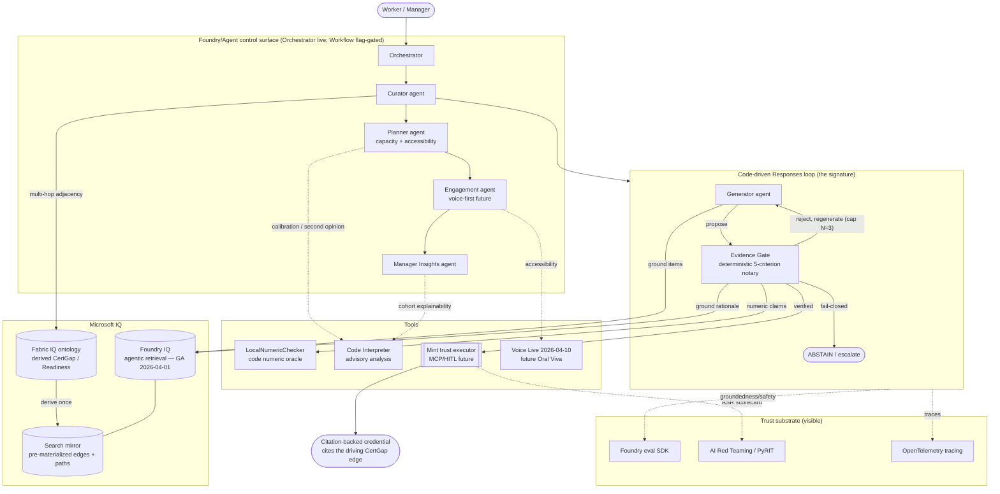

# PathForward — Architecture

> Foundry-centric. Every box maps to a Microsoft service or a module in this repo.
> This is the diagram for the submission (the rubric requires an architecture diagram
> showing the Microsoft tools).

## Agent topology + IQ wiring



## Key decisions (hardened by the red-team — see ../Microsoft-Agents-League/04-Plan-Redteam.md)

| Area | Decision |
|---|---|
| Loop | **Agentic tool-calling on the GA Responses API**: gpt‑5.5 is given the retrieval tool and *itself* decides when to call it (`tool_choice='auto'`, not `'required'`). Server-side prompt agents *with tools* DO exist on `azure-ai-projects 2.2.0` (`PromptAgentDefinition` / `create_version`); the classic thread/run surface is **deprecated (retiring 2027-03-31)**, not yet removed. The orchestrator still owns the payload → citations propagate deterministically, and the Evidence Gate (deterministic notary, formerly "Verifier") gates on `corpus ∩ retrieved`. |
| Grounding | The model's tool is the **GA agentic-retrieval knowledge base** (`KnowledgeBaseRetrievalClient`, `2026-04-01`, extractive `intents[]` + citations). **gpt‑5.5 plans/authors the searches; Search reranks + cites, it does not plan** (Search-side query planning is preview — kept off the critical path). |
| Fabric | Ontology authored as a **non-Power BI Fabric item** on a **paid F2+** (or Power BI Premium **P1+**) capacity (Trial can't run the data agent). The **Search mirror** remains the runtime grounding path for item generation; the **Fabric data agent** is now a live, read-only Program Insights path over OneLake (`source="fabric-live"`), advisory and off the mint path. |
| Mirror | Pre-materializes base + **derived** edges (provenance + validity-time) + traversal paths as first-class docs; build-time non-empty guard. |
| Region | **East US 2** — our chosen co-location for Foundry + gpt-5.5 + Fabric. *Not the only viable region* (gpt-5.5 spans ~6 regions, Voice Live agent mode ~17; e.g. **Sweden Central** also satisfies all four). **Azure AI Search runs in East US** — note **both East US and East US 2 carry the Search capacity-constraint footnote**, so this is an operational placement, not a capacity workaround. Cross-region Search↔model is fine — only the Fabric data agent needs co-location. |
| Reliability | Loop hard-capped **N=3 → fail-closed abstain**; the credential mint refuses abstained results and asserts `cited_edge_id == driving CertGap edge`. |
| Observability | **OpenTelemetry tracing** (`pathforward/obs/tracing.py`) makes the reasoning flow a timed **span tree**. `scripts/trace_demo.py` shows the focused propose→verify→(reject→regenerate)→mint loop; `scripts/trace_full_flow.py` shows Skill load, Orchestrator routing, Curator, Generator, Critic, adaptive band, bounded reflection, Evidence Gate, Planner, Program Insights/Fabric, mint, and fail-closed ABSTAIN. `gate.struck`, `reflection.prepared`, `reflection.applied`, `adaptive.band_selected`, and `abstained.fail_closed` are real span events; grounding/retrieval/readiness are span attributes. Optional/no-op unless configured, exporting to Console and **Azure Monitor / Application Insights** when `AZURE_MONITOR_CONNECTION_STRING` is set. Azure Monitor export was live-verified on 2026-06-09 (`azure_export=on`); span metadata only (no raw-model-call capture); `opentelemetry-sdk` pinned to 1.37 for exporter compat. |
| Eval / Safety | A **deterministic eval + red-team pack** (`pathforward/eval/`, `scripts/eval_groundedness.py`, `scripts/redteam_live.py`, `scripts/eval_orchestrator_live.py`) — pass/fail decided in code, never an LLM judge. A 22-family adversarial taxonomy hardened the trust boundary (cross-worker mint contamination, derived-not-supplied readiness, homoglyph leakage, numeric tie-back, uncorpused-skill refusal). Older loop numbers remain recorded separately; the **skill-loaded Orchestrator path** now has its own live scorecards (2026-06-09): **16/16 grounded + spine-intact** and **0.0% ASR — 16/16 defenses held**, including reflection-channel and Orchestrator route attacks. Microsoft Foundry's GroundednessEvaluator is a corroborating second opinion when enabled. Known LLM-judgment limitations are documented, not hidden. |
| Governance / Skills | A real **Foundry Skill** (`pathforward`) is sourced from `skills/pathforward/SKILL.md` in the `agentskills.io` shape, registered by `scripts/build_toolbox.py`, attached to **Foundry Toolbox** `pathforward-toolbox`, and exposed through the toolbox MCP endpoint. Live proof (`scripts/smoke_toolbox_skill_live.py`, 2026-06-09) calls `tools/list`, `resources/list`, and `resources/read` (`skill://pathforward/SKILL.md`), then injects the MCP-loaded `/pathforward` skill into the Foundry Orchestrator before running the gate/mint spine. This makes the Orchestrator skill path load-bearing, not merely registry evidence. Specialist Skill sources now exist for Curator, Assessment/Generator+Critic, Planner, and Program Insights and are runtime-injected in the offline/full-flow path; they still need a rebuilt Foundry Toolbox and MCP readback before being called live-proven. Toolbox-level RAI policy `pathforward-rai` was accepted by create-version but rejected by the MCP consume endpoint, so the toolbox now omits toolbox-level RAI by default; model/deployment RAI remains separate. Direct-attached Generator/Search and Fabric tool paths still exist as fallback/test seams and should not be described as the final primary architecture once the Skill/Toolbox path is expanded. |

## Multi-agent reasoning loop (implemented)

The "Foundry Workflow" box is realized in code as `run_multiagent` (`pathforward/agents/orchestrator.py`):
**Curator → Generator → Critic → Evidence Gate (deterministic notary) → Planner → Program Insights**,
agents doing the reasoning and code notarizing the trust boundary; the Critic agent before the gate
is implemented and advisory-only (see ADR 006).
Each LLM step is paired with a code-owned gate (the project thesis — *reasoning proposes, code verifies*):
the **Curator** (`curator.py`) ranks the CertGap skills but the choice is restricted to the derivation's
*assessable* gap set; the **Planner** (`planner.py`) proposes a pace/plan but the hours (cert blueprint),
the weekly phasing (worker capacity), the arithmetic (`NumericChecker`), and the accessibility
adaptations (fixed vocabulary) are all code-owned. The Planner is advisory — outside the credential
trust chain. (The read-only **Program Insights** agent is built — ADR 007; `Engagement`/voice is unbuilt.)

## Bounded Orchestrator / Conductor (implemented, live-smoke-proven)

Checklist #1 adds a real Orchestrator/Conductor surface in `pathforward/agents/conductor.py` and
`run_orchestrated_multiagent` (`pathforward/agents/orchestrator.py`). The Orchestrator is an
`LLMClient`-backed route reasoner: it may propose bounded actions such as `curate`, `assess`, `plan`,
`insights`, and `mint_if_verified`, but deterministic code validates the route before execution. It
cannot set `status="verified"`, override the Evidence Gate, pick a non-admissible skill, or call mint
directly. This slice is offline-proven by `tests/test_conductor.py` and live-smoke-proven by
`scripts/smoke_orchestrator_live.py` (`pathforward-orchestrator` selected admissible S08 and minted
through the existing code spine). The Orchestrator can also consume the MCP-loaded `/pathforward`
Foundry Skill from `pathforward-toolbox` (`scripts/smoke_toolbox_skill_live.py`). Orchestrator-specific
safety was re-measured with `scripts/eval_orchestrator_live.py` (16/16 grounded + spine-intact, 0.0%
ASR on 16 attacks). Full-flow proof tracing is implemented in `scripts/trace_full_flow.py`.

## The same chain as an Agent Framework Workflow (flag-gated, ADOPT-LATER — ADR 009)

The reasoning chain is **also** expressed as a Microsoft Agent Framework Workflow graph, behind the
`PF_WORKFLOW` flag, so the trust boundary is a deterministic **code node** (which the Foundry
portal/YAML Workflows product cannot express — no first-class code node, logic is Power Fx — so that
product is **avoided for the trust path**). `pathforward/agents/workflow.py` holds a
framework-agnostic graph spec; `workflow_foundry.py` projects it onto `agent_framework` (Python **GA
1.0.0**, 2026-04-02), imported lazily (the SDK is not provisioned here; the offline suite stays green).

```
  Curator (agent) ──assessable gap──▶ assess  [TRUST: run_assessment_loop + Evidence Gate]
        │                                  │ verified                │ abstained (fail-closed)
        │ no gap ─▶ ABSTAIN                ▼                          ▼
        │                          Human approval (HITL)           ABSTAIN
        │                          ctx.request_info()
        │                              │ approve        │ refuse
        │                              ▼                ▼
        │                          Credential mint    ABSTAIN
        │                          [TRUST] (re-derives readiness, re-checks the spine)
        │                              ▼
        │                          Credential issued
        └─ advisory ─▶ Planner ─▶ Program Insights ─▶ advisory output   (never reaches the mint)
```

The trust claim is a **developer-proven graph-shape property** (NOT a framework guarantee — `build()`
validates types/connectivity, not our invariant): a graph-shape test proves no path reaches `mint`
without traversing the deterministic `assess` node (the cut-vertex), no agent writes the credential,
and the gate oracle is `LocalNumericChecker`. The assessment loop is **one** deterministic executor
that delegates to the existing `run_assessment_loop`, so `status="verified"` is still written in
exactly one place (`loop.py`) — the Workflow never becomes a second trust authority. `run_multiagent`
stays the always-green in-process spine.

## Offline ↔ Azure boundary

The deterministic rehearsal/test path runs offline against `FakeLLMClient` + `LocalNumericChecker`.
The product-shaped Azure layer swaps in live Foundry/Fabric clients behind the identical seams, so
the reasoning logic and deterministic gates are unchanged:
- **Generator** → `FoundryLLMClient` (Responses API + Azure AI Search tool, agentic retrieval).
- **Curator / Planner / Critic / derivation-floor Program Insights** → `ReasoningFoundryClient`
  (tool-less `PromptAgentDefinition` + `strict=False` json_schema; they reason over structured
  ontology data, not retrieval). Validated live by `scripts/smoke_multiagent_live.py`.
- **Fabric Program Insights** → `FabricInsightsClient` (`MicrosoftFabricPreviewTool` on a prompt
  agent; OBO user identity; `tool_choice="required"`), validated live by `scripts/smoke_fabric_live.py`.
- **Numeric** → `LocalNumericChecker` stays the **sole** gate oracle, offline AND live (the gate's
  arithmetic must be deterministic code). Code Interpreter is wired separately as a **non-gating**
  advisory analyst (`agents/analyst.py`: `CodeInterpreterAnalyst`) for second-opinion + calibration
  explainability — never the oracle (the model writes the code → non-deterministic). See ADR 008.

The interfaces are identical, so swapping FakeLLM for live Foundry/Fabric clients does not change the
reasoning logic or the deterministic gates. The default storyboard demo and web fixture may still use
FakeLLM for repeatability, but that is not the production scope.
